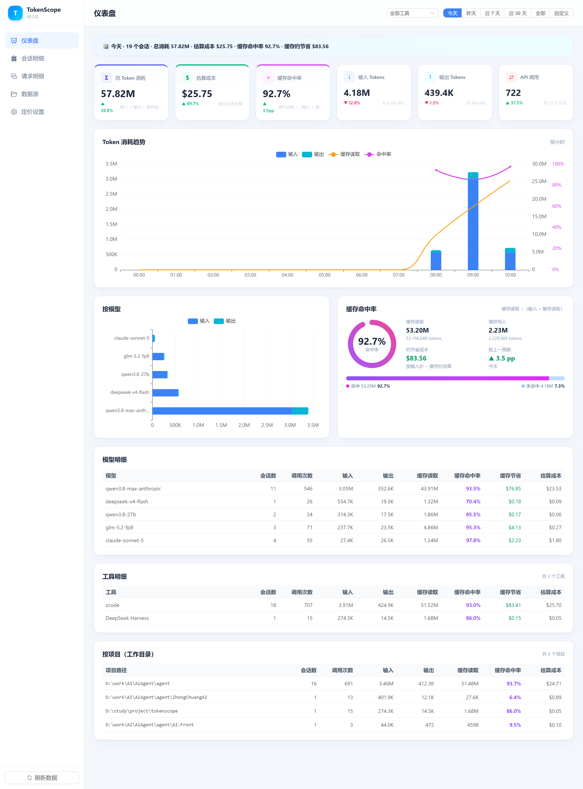
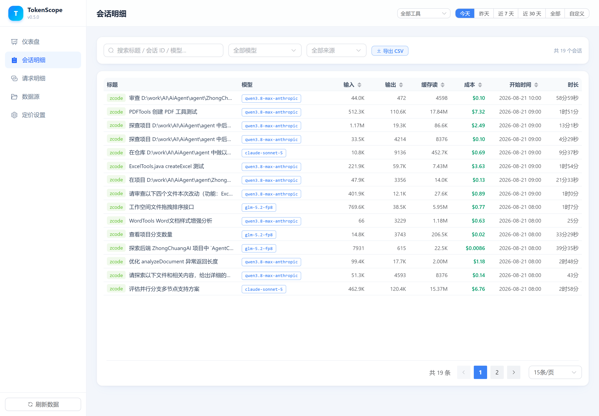
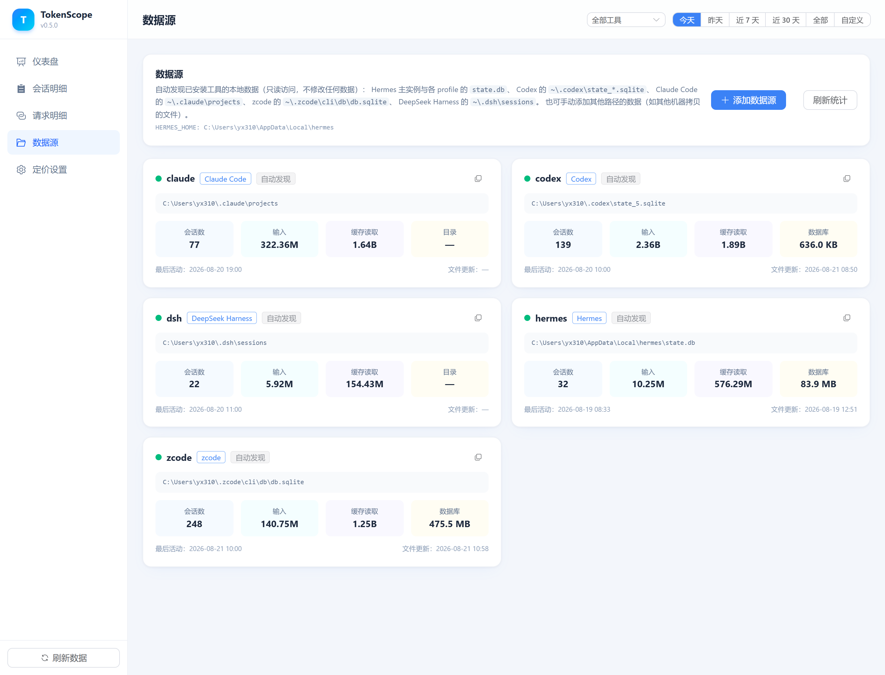

# TokenScope · AI 编程 Token 用量看板

[](LICENSE)
[](https://github.com/Eveerme/tokenscope/actions/workflows/ci.yml)
[](server.py)
[](web/package.json)
[](docs/安装手册.md)

统计 **Hermes / Codex / Claude Code / zcode / DeepSeek Harness** 等 AI 编程工具的 token 消耗与成本。本地运行、只读访问、**数据不出本机**，工具类型持续扩展中（类似 cc-switch 的用量统计页）。

## 截图







## 功能特性

- **仪表盘**：输入 / 输出 / 缓存读取 / 推理 tokens、API 调用、会话数、估算成本总览；按天/周/月趋势图；按模型、工具、来源、任务类型分组图表；**按项目（工作目录）** 聚合明细表
- **全局筛选**：工具下拉 + 时间范围（近 7/30/90 天、全部、自定义），所有视图联动
- **会话明细**：多工具全量会话表格，搜索（标题 / ID / 模型 / 工具 / 工作目录）、模型 / 来源筛选、任意列排序、分页；点击行查看详情（工作目录、token 卡片，Hermes 会话另有任务级拆分）
- **CSV 导出**：按当前筛选条件一键导出会话明细（UTF-8 BOM，Excel 直接打开）
- **数据源**：自动发现各工具本地数据；可手动添加其他路径（如其他机器拷贝的文件）；**只读访问，不修改任何数据**
- **定价设置**：按模型配置单价（USD / 百万 tokens），实时估算成本；**每次启动自动从 [models.dev](https://models.dev/) 拉取最新官方定价**（离线时沿用本地），「更新定价」按钮可手动刷新；同一模型被多家收录时优先取官方 provider 价格

## 支持的工具

| 工具 | 数据位置 | 明细粒度 |
|---|---|---|
| Hermes | `%LOCALAPPDATA%\hermes\state.db`（+ profiles/*/state.db） | 会话级 + 任务级（session_model_usage） |
| Codex | `~/.codex/state_*.sqlite` + `sessions/**/rollout-*.jsonl`（含 `archived_sessions/` 孤儿会话） | 会话级（rollout JSONL 拆分 input/cached/output/reasoning） |
| Claude Code | `~/.claude/projects/*/*.jsonl`（+ 同级 `transcripts/` 裸转录） | 会话级（assistant 消息 usage 累加） |
| zcode | `~/.zcode/cli/db/db.sqlite` | 会话级（model_usage 请求级明细聚合，缓存口径归一化） |
| DeepSeek Harness | `~/.dsh/sessions/<编码cwd>/<会话id>/session.jsonl[.zstd]` | 会话级（事件流 usage 累加，zstd 多帧自动解压） |

> 新增工具只需在 `parsers.py` 增加一个解析函数 + 自动发现条目，欢迎提交 PR。

## 快速开始

**环境要求**：Python 3.8+（后端零第三方依赖）；Node.js 18+（仅前端构建时需要）

```bash
# 1. 获取项目
git clone https://github.com/Eveerme/tokenscope.git
cd tokenscope

# 2. 构建前端（仅首次或前端改动后）
cd web
npm install
npm run build
cd ..

# 3. 启动
./start.sh              # 后台运行 + 健康检查（Windows git-bash / Linux / macOS 均可）
# 或直接: python server.py   # 默认 http://127.0.0.1:8787

# 停止 / 重启
./stop.sh
./restart.sh
```

浏览器访问 **http://127.0.0.1:8787/**（默认仅监听本机；局域网访问用 `HOST=0.0.0.0 ./start.sh`）。

> 📦 完整安装说明见 [安装手册](docs/安装手册.md)，功能使用见 [使用手册](docs/使用手册.md)

## 隐私与安全

- **全部本地运行**：无任何外部服务、遥测或数据上报
- **只读访问**：SQLite 以 `PRAGMA query_only` 打开，JSONL 只读解析，不修改任何工具数据
- **默认仅监听 127.0.0.1**，不对外暴露
- 个人配置（数据源路径、定价表）保存在本机 `config.json`（已 gitignore，不会入库）

## 数据口径说明

- **缓存读取**通常远大于输入：长会话历史上下文大量命中缓存，属正常现象（各家 API 缓存价格通常约为输入价的 1/10）
- **成本估算**基于「定价设置」中的单价（USD/百万 tokens），内置价格仅供参考，请按实际渠道价配置；未配置定价的模型成本显示「—」
- Codex 会话来源按 `session_meta.originator` 判定（Codex Desktop → 桌面端，CLI → 终端），不受其内部 `source=vscode` 字段误导；`archived_sessions/` 下未被 state DB 引用的孤儿 rollout 也会被扫描统计
- Claude 项目目录名按官方编码规则解码为工作目录（`D--work-AI-Proj` → `D:\work\AI\Proj`）；同级 `transcripts/` 目录的裸转录文件（无项目结构）一并统计，工作目录显示为空
- **zcode 缓存口径归一化**：zcode 的 `input_tokens` 为「缓存包含式」（已含 cache_read/cache_write），直接累加会重复计数缓存。解析时按 `computed_total_tokens` 判定口径，包含式则从 input 中减去缓存/推理重叠，使 `input+output+cache_read+cache_write+reasoning` 与 `computed_total_tokens` 一致
- **DeepSeek Harness（DSH）**：`inputTokens` 为「未命中缓存的输入」（与缓存读取不相交），`reasoningTokens` 是 `outputTokens` 的子集（故 `output = outputTokens - reasoningTokens`）；fork 会话 `seedLength` 之前的父会话重放事件跳过，避免重复计数；`session.jsonl.zstd` 为 zstd 多帧压缩，按帧魔数自动解压（需 `pip install zstandard`，缺失时回退 zstd CLI，再缺失则跳过 .zstd 文件）

## 项目结构

```
tokenscope/
├── server.py        # 后端：REST API + 静态文件伺服（纯标准库，零依赖）
├── parsers.py       # 多工具统一解析器（数据源发现 + 记录解析 + 缓存）
├── start.sh / stop.sh / restart.sh
├── config.json      # 运行时生成（个人配置，不入库）
├── docs/
│   ├── 安装手册.md / 使用手册.md / screenshots/
├── tests/           # pytest 单元测试（五解析器 + 聚合层，mock 数据）
└── web/             # 前端（Vue3 + TS + Element Plus + Tailwind v4 + ECharts）
```

## 开发与测试

```bash
pip install pytest
python -m pytest tests/ -v        # 58 个用例：五工具解析、聚合、筛选、导出
cd web && npm run dev              # 前端热更新开发模式（API 代理到 8787）
```

## 贡献

欢迎提交 Issue 与 PR：

- 新工具解析器（Gemini CLI / Cursor / Windsurf / opencode 等）
- CSV 之外的数据导出格式
- 英文文档 / 国际化

## License

[MIT](LICENSE) © Eveerme
